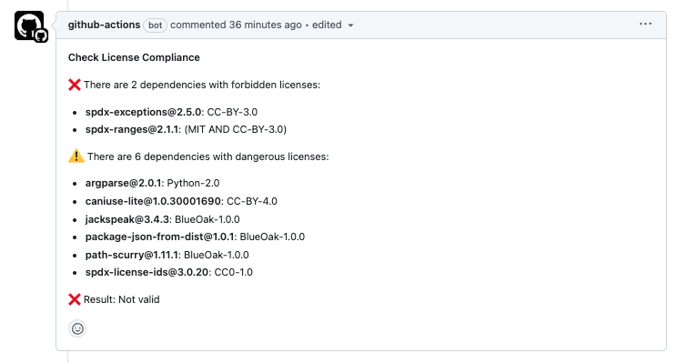

# Check License Compliance

Checks that repository dependencies are compliant with allowed licenses according to a given configuration.

## Table of Contents

- [Preface](#preface)
- [Usage](#usage)
  - [PR comments](#pr-comments)
- [Configuration](#configuration)
  - [Configuration file](#configuration-file)
  - [Inputs](#inputs)
  - [Configuration example](#configuration-example)
- [Systems](#systems)
- [Outputs](#outputs)
- [Contributing](#contributing)
- [License](#license)

## Preface

This repository contains a GitHub Action that checks that repository dependencies are compliant with allowed licenses according to a given configuration.

It is able to check the licenses of dependencies from next systems:

* Node.js (NPM)
* Python (PyPi)
* Maven
* Go

__It does not require to install the dependencies before checking__. It scans the `package.json`, `requirements.txt`, `pom.xml`, or `go.mod` files to get the dependencies, and then it retrieves the dependencies tree information recursively from the [deps.dev API](https://deps.dev/) and performs the check.

For better user experience in PRs, this repository also contains a Github Composite Action that performs the check and posts the results into a comment in the PR. Read the [PR comments](#pr-comments) section for more information.

## Usage

Create a configuration file `check-license-compliance.config.yml` at the root of your repository, containing the [forbidden, allowed, or warning licenses](#configuration) and the [other options](#configuration-file) you want to set.

Then, create a GitHub Actions workflow file that uses the action. The action will check the dependencies according to the options defined in the [action inputs](#inputs) and in the [configuration file](#configuration-file).

The main option is the `licenses` property, which contains the allowed, forbidden, and warning licenses. The licenses can be simple [SPDX license identifiers](https://spdx.dev/learn/handling-license-info/) like _MIT_, plus-ranges like _EPL-2.0+_, or licenses with exceptions like _Apache-2.0 WITH LLVM_. __They may not be compound expressions using AND or OR.__ You can also use not valid SPDX identifiers, and, in such case, the license will be matched simply by a string comparison.

* `allowed`: Dependencies with these licenses are allowed.
* `warning`: Dependencies with these licenses will produce a warning, but the check will be considered valid. Use it when you want to be notified about the presence of these licenses, but you don't want to fail the check.
* `forbidden`: Dependencies with these licenses are forbidden, they will make the check fail. Use it when you want to explicitly disallow these licenses (it makes more sense when the `others` property is set to `warning`, otherwise, you can simply not include them in the `allowed` or `warning` lists).
* `others`: Determines whether dependencies with licenses not defined in the previous lists should produce a warning or make the check fail. Possible values are `forbidden` or `warning`. Default is `forbidden`.
* `unknown`: Determines whether dependencies which license cannot be determined should produce a warning or make the check fail. Possible values are `forbidden` or `warning`. Default is `warning`.

> [!NOTE]
> Using a [configuration file](#configuration-file) is optional. You can also use the [action inputs](#inputs) to define the [configuration](#configuration).

```yaml
# License Compliance configuration
licenses:
  allowed:
    - Apache-2.0
    - MIT
  warning:
    - LGPL-3.0
    - LGPL-2.0
    - MPL-2.0
  others: "forbidden"
  unknown: "warning"
```

Example of a GitHub Actions workflow file:

```yaml
name: Check License Compliance

on: push

jobs:
  check-license-compliance:
    runs-on: ubuntu-latest
    steps:
      - uses: actions/checkout@v4

      - name: Check Licenses
        uses: Telefonica/check-license-compliance@v3
```

That's it! The action will check the dependencies according to the configuration file on every push 🚀.

### PR comments

This repository also includes a Github Composite Action that performs the check and posts the results into a comment in the PR.



The composite action accepts the [same inputs as the main action](#inputs), except for:
  * `reporter` - The `reporter` option is always set to `markdown`.

Here you have an example of a GitHub Actions workflow file using the `check-and-comment` action:

```yaml
name: Check License Compliance

on: pull_request

permissions:
  contents: read
  pull-requests: write
  statuses: write

jobs:
  check-license-compliance:
    runs-on: ubuntu-latest

    steps:
      - uses: actions/checkout@v4

      - name: Check Licenses
        uses: Telefonica/check-license-compliance/.github/actions/check-and-comment@v3
        env:
          GITHUB_TOKEN: ${{ secrets.GITHUB_TOKEN }}
```

## Configuration

### Configuration file

The configuration file is a YAML file that must be placed at the root of your repository by default (you can also change the path by using the [action inputs](#inputs)). It can contain the following properties:

* `licenses`: Object containing details about the licenses that are allowed, forbidden, or should produce a warning. Licenses are identified by their [SPDX identifier](https://spdx.org/licenses/).
  * `allowed`: Dependencies with these licenses are allowed.
  * `warning`: Dependencies with these licenses will produce a warning, but the check will be considered valid. Use it when you want to be notified about the presence of these licenses, but you don't want to fail the check.
  * `forbidden`: Dependencies with these licenses are forbidden, they will make the check fail. Use it when you want to explicitly disallow these licenses (it makes more sense when the `others` property is set to `warning`, otherwise, you can simply not include them in the `allowed` or `warning` lists).
  * `others`: Determines whether dependencies with licenses not defined in the previous lists should produce a warning or make the check fail. Possible values are `forbidden` or `warning`. Default is `forbidden`.
  * `unknown`: Determines whether dependencies which license cannot be determined should produce a warning or make the check fail. Possible values are `forbidden` or `warning`. Default is `warning`.
* `production`: Whether to check production dependencies or not. Default is `true`.
* `development`: Whether to check development dependencies or not. Default is `true`.
* `onlyDirect`: Check only direct dependencies. Default is `false`.
* `npm|python|go|maven`: Object containing specific options for each different system:
  * `includeFiles`: List of [globbing patterns](https://github.com/cowboy/node-globule) for files to include in the check. If not defined, all files will be checked according to the [default configuration of each different system](#systems)
  * `developmentFiles`: List of [globbing patterns](https://github.com/cowboy/node-globule) for files containing only development dependencies. If not defined, the default development files will be checked according to the [default configuration of each different system](#systems). You don't have to exclude this patterns from the `includeFiles` property (files matching both patterns will be considered as development files).
  * `excludeFiles`: List of [globbing patterns](https://github.com/cowboy/node-globule) for files to exclude from the check. Both `includeFiles` and `developmentFiles` patterns will be excluded from this list. If not defined, files will be excluded according to the [default configuration of each different system](#systems).
  * `modules`: List of [modules](#module-options) to check. If not defined, all modules will be checked.
  * `excludeModules`: List of [modules](#module-options) to exclude from the check. (The information about the module will be still retrieved, and its dependencies will be checked, but the module itself will be ignored in the check, unless you set the `ignore` property to `true` in the [module options](#module-options)).
  * `extraModules`: List of modules (`name@version`) to add to the check. This is useful when you want to check additional modules that are not directly defined in the dependencies tree.
  * ...each system may also have its own specific options. Check the [Systems](#systems) section for more information.
* `failOnNotValid`: Boolean indicating if the check should fail (exit 1) when the result is not valid. Default is `true`.
* `reporter`: Reporter to use. Possible values are `text`, `markdown` and `json`. Default is `text`. Further info in the [Reporters](#reporters) section.
* `log`: Log level to use. Possible values are `silly`, `debug`, `info`, `warning` and `error`. Default is `info`. This option enables logs for the headers check. You can also enable logs for the action itself _(useful if you find any problem while the action is loading the configuration, for example)_ by setting the `ACTIONS_STEP_DEBUG` secret to `true`.

> [!TIP]
> Read the __[How it works section](#how-it-works)__ to understand how the action checks the licenses for better understanding of the configuration options, and the __[Systems section](#systems)__ to know the default configuration for each system.

#### Module options

In the configuration, there are options enabling to define the list of modules to check or to exclude from the check (`[system]/modules` and `[system]/excludeModules`). A module can be defined in two ways:

1. A module and version string, like `express@4.17.1`. In this case, only the specific version will be included or excluded.
2. A module name as string, like `express`. In this case, all versions of the module will be included or excluded.
3. An object with some of the following properties. You have to provide at least one of the properties `name` or `nameMatch`. If no version is provided, the module will be included or excluded regardless of the version.
    * `name`: The module name.
    * `nameMatch`: A regex pattern to match the module name. When defined, the `name` property will be ignored.
    * `version`: The module version.
    * `versionMatch`: A regex pattern to match the module version. When defined, the `version` and `semver` properties will be ignored.
    * `semver`: The module version, defined using [semver expressions](https://semver.org/). This is useful when you want to include or exclude only a range of versions of a module, for example. The `version` property will be ignored when this property is defined. NOTE:
        * It will include ox exclude the versions that satisfy the expression. Note that, in case the dependency version is expressed using a semver expression in the project in systems supporting it (NPM), the action will resolve the version to the minimum version that satisfies it. So, it will compare the minimum version that satisfies the expression in the dependency with the expression in the configuration. If the dependency version is lower, it will be included (`modules` option) or excluded (`excludeModules` option) from the check.
    * `ignore`: Boolean value to completely ignore the module and its dependencies. If set to `true`, the module will be completely ignored. Neither the information about the module nor its dependencies will be retrieved from the [deps.dev API](https://deps.dev/). This is useful when you want to exclude a module and its dependencies from the check, or for local private packages in monorepos. This property has only sense in the `excludeModules` option. Default is `false`.

Examples:

```yaml

npm:
  excludeModules:
    - express@4.17.1
    - name: "express"
    - name: "express"
      version: "4.17.1"
    - name: "express"
      versionMatch: "4.*"
    - name: "express"
      semver: ">4"
    - nameMatch: "@react/.*"
      versionMatch: "^17\.1\.[12]$"
    - nameMatch: "@react/.*"
      semver: "^17.0.0"
      ignore: true # This will also ignore the module and its dependencies when retrieving the information from the deps.dev API
    
```

### Inputs

The action also allows to set the configuration by using inputs. When defined, they will override the values in the [configuration file](#configuration-file). The inputs are:

* `path`: Path in the repository where to execute the action. Default is `.`. Note that this can't be an absolute path, only a relative path from the repository root.
* `config-file`: Path to the configuration file, resolved from the `path` option. Default is `check-license-compliance.config.yml`.
* `reporter`: Reporter to use. Possible values are `text`, `markdown` and `json`. Default is `text`.
* `log`: Log level to use. Possible values are `silly`, `debug`, `info`, `warning` and `error`. Default is `info`.
* `fail-on-not-valid`: Boolean value to determine if the action should fail (exit 1) when the result is not valid.
* `config`: Multiline string with the whole [configuration](#configuration) expressed as a JSON object as in the configuration file. It will extend the values defined in the [configuration file](#configuration-file). Any config value that is defined in other inputs will override the values here. NOTE: Here you should use JSON instead of YAML to avoid indentation issues.
    Example:

    ```yaml
    config: |
      {
        "licenses": {
          "allowed": ["Apache-2.0", "MIT"]
        },
        "direct": false
      }
    ```


> [!WARNING]
> Note that some properties are defined in camelCase in the configuration file, while they are defined in kebab-case in the inputs. This is because the configuration file tries to follow NodeJs conventions in order to pass the values directly to the underlying library, while the inputs follow a GitHub Actions convention.

### Configuration example

> [!TIP]
> Note that you can use the inputs to override the values in the configuration file, or even to define the whole configuration in the `config` input if you don't want to use a file.

So, you can use the configuration file, the inputs, or both. The action will merge the values in the following order:

1. Values in the configuration file.
2. Values in the `config` input.
3. The rest of the inputs.

Example of a complex configuration using both the configuration file and the inputs:

```yaml
# Configuration file
production: true
node:
  includeFiles:
    - "**/package.json"
  excludeFiles:
    - "some/folder/to/exclude/**"
  excludeModules:
    - "express@4.17.1"
```

```yaml
# GitHub Actions workflow file with inputs
name: Check License Compliance

on: push

jobs:
  check-license-compliance:
    runs-on: ubuntu-latest
    steps:
      - uses: actions/checkout@v4

      - name: Check Licenses
        uses: Telefonica/check-license-compliance@v3
        with:
          config-file: "check-licenses.config.yml"
          # Properties defined at input first level will have preference over values defined in any other place
          reporter: "markdown"
          log: "debug"
          # This will extend the values in the configuration file
          config: |
            {
              "licenses": {
                "allowed": ["Apache-2.0", "MIT"]
              }
              "production": false
            }
```

## Systems

Here you have the default configuration for each system, as well as the default files that are checked, etc.

> [!TIP]
> If you want to fully disable the check for a system, you can set the `includeFiles` property of that system to an empty list, or the `excludeFiles` property to `["**"]`.

Note that you can also set next options in every system configuration:

* `modules`: List of [modules](#module-options) to check. If not defined, all modules will be checked.
* `excludeModules`: List of [modules](#module-options) to exclude from the check.
* `extraModules`: List of modules (`name@version`) to add to the check. This is useful when you want to check additional modules that are not directly defined in the dependencies tree (see an usage example in the [Python](#python) section).

### NPM

Default configuration:

```yaml
npm:
  includeFiles:
    - "**/package.json"
  developmentFiles: []
  excludeFiles:
    - "**/node_modules/**"
```

#### Resolving semver expressions

When a dependency is defined using semver expressions (like `^1.0.0`), the action will resolve the version to the minimum version that satisfies the expression. This is done by using the [semver library](https://github.com/npm/node-semver).

#### Development dependencies

Dependencies defined in`devDependencies` in any `package.json` file will be considered as development dependencies.

You can also define a `developmentFiles` property in the configuration to match files that contain only development dependencies. This may be useful when you have a monorepo with private packages that are used only in development, for example.

### Python

Default configuration:

```yaml
python:
  includeFiles:
    - "**/requirements.txt"
  developmentFiles:
    - "**/requirements-dev.txt"
  excludeFiles:
    - "**/venv/**"
    - "**/.venv/**"
```

#### Loading requirements recursively

When a `requirements.txt` file contains a line with `-r file.txt` or `--requirement file.txt`, the action will load the dependencies from the `file.txt` file recursively. You can disable this behavior by setting the `recursiveRequirements` property to `false`.

#### Extra dependencies

When a `requirements.txt` defines extra dependencies for a library using the `[extra]` section, the action will ignore them. You can include them manually in the check by getting the real dependency name and version from the corresponding `setup.py` file, and adding them to the `extraModules` property in the `python` configuration.

#### Version specifiers

When versions are defined using [version specifiers](https://packaging.python.org/en/latest/specifications/version-specifiers/#id5), the action will ignore them and check the license of the dependency with the version that is defined. The exception to this is the `!=` specifier, in which case it will use the latest available version.

### Maven

Default configuration:

```yaml
maven:
  includeFiles:
    - "**/pom.xml"
  developmentFiles: []
  excludeFiles: []
```

#### Reading the POM file

The action is able to read the POM file and get the dependencies from the `project.dependencies` section. It will also read the `project.properties` section to get the properties that are used in the dependencies version. It automatically resolves the versions of the dependencies defined with `${property}`.

### Go

Default configuration:

```yaml
go:
  includeFiles:
    - "**/go.mod"
  developmentFiles: []
  excludeFiles: ["**/vendor/**"]
```

#### Reading the go.mod file

The action is able to read the `go.mod` file and get the dependencies from the `require` section.

## Outputs

The action returns the following outputs:

* `found-forbidden`: A boolean value indicating whether any forbidden license was found.
* `found-warning`: A boolean value indicating whether any warning license was found.
* `valid`: A boolean value indicating whether the check is valid or not. The check is considered valid if no forbidden licenses are found and the `allowWarnings` property is set to `true` or no warning licenses are found.
* `report`: A report containing details about the result of the check. The report can be returned in different formats, that can be defined by using the [`reporter` configuration property](#configuration). The possible values are:
  * `text`: Generates a text report. This is the default reporter.
  * `markdown`: Generates a markdown report. This is very useful if you want to send the results to a GitHub comment in a PR, for example.
  * `json`: Generates a JSON report. This is useful if you want to process the results in a script, for example. __Note that Github Actions outputs are always strings, so you will need to parse the JSON in your workflow.__ The JSON report contains all details about the compliance check, including the dependencies that are not compliant, their installation path, the license they have, etc.

## Contributing

Please read our [Contributing Guidelines](./.github/CONTRIBUTING.md) for details on how to contribute to this project before submitting a pull request.

## License

This project is licensed under the Apache-2.0 License - see the [LICENSE](./LICENSE) file for details. Read the Apache-2.0 FAQ at https://www.apache.org/foundation/license-faq.html
